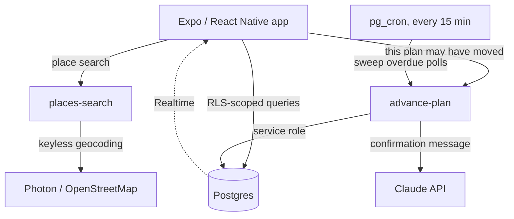
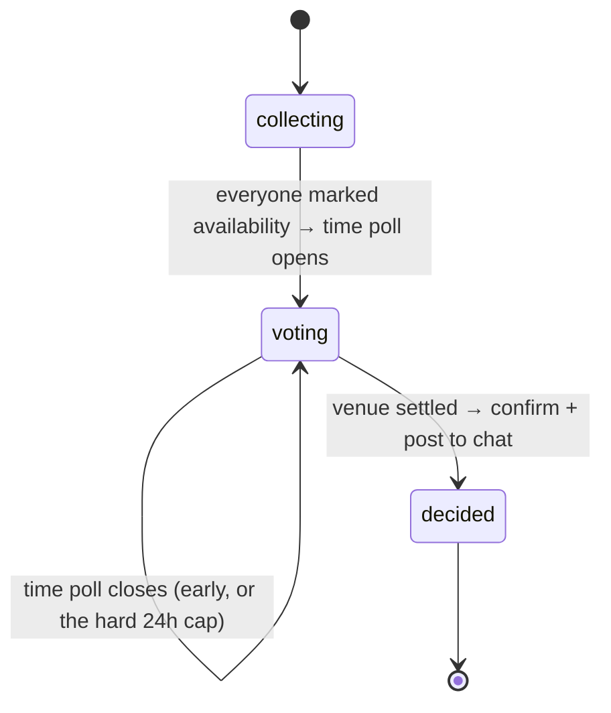

<div align="center">


# Planora

**Group plans that settle themselves.**

Everyone marks when they're free, the group votes, and the plan confirms itself:
time, place, done. No forty-message thread that ends in nobody going.

[**Download for Android**](https://planorafun.vercel.app) · [Privacy policy](https://planorafun.vercel.app/privacy)


</div>

---

## What it does

Deciding when five people can meet is a scheduling problem that group chats are
bad at. Planora turns it into four taps.

1. **Start a plan** and share a link. People join by tapping it. No accounts to
   look up, nobody added by hand.
2. **Everyone drags the hours they're free** on a week grid. That's the only
   input the app ever asks for.
3. **The server computes the overlap**, picks the three hours that suit the most
   people, and opens a vote on them.
4. **The organiser shortlists two or three real venues** and the group votes.
   One obvious choice? It skips the vote entirely.
5. **The plan confirms itself**, announces the result in the group chat, and
   lands on everyone's calendar with the address.

The product rule underneath all of it: **the organiser has no special power.**
They can rename the plan. They cannot move the time, override the venue, or
settle anything the group is voting on, and that isn't UI politeness; the
database refuses.

## Why it's interesting to read

This is a small app with a deliberately strict back end. The parts worth a look:

| | |
|---|---|
| **Authorisation lives in Postgres** | 17 row-level security policies across 9 tables, not middleware. A non-attendee cannot read a plan, vote in it, post to it, or write availability as someone else. It's enforced where the data is, so a bug in the client can't widen it. |
| **One idempotent state machine** | `advance-plan` is the only thing that moves a plan forward. Every caller just says "this plan may have moved"; the function works out what, if anything, is next. Each transition is separate so an interrupted run resumes instead of stranding a plan. |
| **The database settles races** | Clients fire the state machine after every action. Eight concurrent calls used to create eight duplicate polls on one plan; a unique index makes that unrepresentable, and the losers back off. |
| **Adversarial test suite** | `npm run audit` runs 42 assertions against the live project *from the attacker's side*: every RLS boundary probed from the wrong direction, every fixed defect replayed, plus a concurrency burst. |
| **Distributed without a store** | Direct APK download with a published SHA-256, an in-app update check, and a deploy that refuses to publish an APK that isn't complete, signed and correctly configured. |

## Architecture



No custom server. Everything server-side is either a Postgres function or a
Supabase Edge Function.

**The plan's lifecycle**, which `advance-plan` owns end to end:



| Layer | Where | Notes |
|---|---|---|
| Screens | `app/` | Expo Router. Tabs for Home / Plans / Profile; one screen per plan |
| Plan sections | `components/plan/*Panel.tsx` | Roadmap / Voting / Chat / Details, behind a segmented control |
| Pure logic | `lib/plans.ts`, `availability.ts`, `roadmap.ts`, `calendar.ts` | No Supabase imports, so the tests load them under plain Node |
| Queries | `lib/planQueries.ts`, `usePlanData.ts` | Everything touching the network |
| Schema | `supabase/migrations/` | 9 migrations; `0001` is the bulk, `0007`–`0009` are the hardening pass |
| Server logic | `supabase/functions/` | `advance-plan` (state machine), `places-search` (proxy) |
| Website | `landing/` | Static download page, invite handler and privacy policy |

## Engineering notes

A few problems that were more interesting than the feature work.

<details>
<summary><b>A NULL comparison was a pre-auth hole</b></summary>

`propose_venues` guarded itself with `if creator <> auth.uid() then raise`.
For an anonymous caller `auth.uid()` is NULL, and `x <> NULL` is NULL rather
than TRUE, so the guard never fired and **anyone could open a venue poll on
any plan without signing in**. Postgres also grants `EXECUTE` to `PUBLIC` by
default, so naming `authenticated` in a grant kept nobody out.

Every authorisation check now rejects a NULL uid explicitly, first. A later
pass found the follow-up mistake too: Supabase grants `EXECUTE` to `anon`
*explicitly*, so revoking from `PUBLIC` leaves that grant in place.
</details>

<details>
<summary><b>Row-level security can't protect a column</b></summary>

`profiles` was readable with `using (true)` so attendee lists worked, but
`email` is a column on that table, so any signed-in user could dump every
address in the database in one request.

RLS is row-level by definition, so the fix is column privileges: revoke the
blanket `SELECT`, re-grant the safe columns, and move email matching inside a
`SECURITY DEFINER` function that returns only id, display name and colour.
Invite-by-email still works; no address ever leaves the database.
</details>

<details>
<summary><b>The same date worked in a browser and crashed on a phone</b></summary>

PostgREST returns timestamps as `2026-09-23 08:00:00+00` (a space instead of
`T`, and a two-digit offset). That is not ISO 8601. V8 parses it leniently, so
every browser test passed; **Hermes returns `Invalid Date`**, and
`toISOString()` on that throws a `RangeError` which ends the process.

All parsing now goes through one normaliser, and the formatters degrade to a
dash instead of throwing.
</details>

<details>
<summary><b>A release build has no red box</b></summary>

An uncaught render error in a React Native release build simply terminates the
app, no message, nothing to report. Combined with the bug above, the only
available symptom was "it instantly closes".

The app now has an error boundary *and* a global handler covering event
handlers, timers and awaits, so any uncaught error shows a copyable error
screen instead of a disappearing app.
</details>

<details>
<summary><b>Making a 60 fps drag survive a phone</b></summary>

The availability grid rebuilt every stylesheet and a fresh `PanResponder` on
each render, `useRef(PanResponder.create(…))` keeps the first value but still
*evaluates* its argument every time, and called `setState` on every pointer
move, re-rendering 112 cells even when the finger hadn't changed cell.

A desktop browser absorbs that. A phone doesn't, and Android terminates an app
whose main thread stops responding.
</details>

## Running it

```bash
npm install
cp .env.example .env.local   # fill in your own Supabase project values
npm run seed                 # two test accounts, three plans, one per stage
npm run dev                  # Metro on :8085
```

Seeded accounts are `demo@planora.test` and `sam@planora.test`, both
`Password123!`. Open them in two browser profiles to be both people at once and
watch votes and chat update live.

```bash
npm run check    # typecheck + 81 pure-logic assertions, across three timezones
npm run audit    # 42 assertions against the live project, adversarially
```

Apply `supabase/migrations/` in order (`npx supabase db push`), or paste them
into the dashboard SQL editor.

> **Running your own copy:** a few committed files (`eas.json`,
> `landing/join.html`, the cron job in `0007`) contain *my* project's Supabase
> URL and publishable key. Those are public by design; they ship inside any app
> bundle, and row-level security is what protects the data, not their secrecy,
> but you'll want to swap them for your own. Nothing secret is committed;
> `.env.local` is gitignored and Edge Function secrets live in Supabase.

## Shipping

There is no app store. The app is an APK downloaded straight from
[planorafun.vercel.app](https://planorafun.vercel.app).

```bash
npm run build:apk   # EAS, arm64-v8a + armeabi-v7a
npm run release     # record which build to publish
npm run deploy      # Vercel fetches it, verifies it, publishes it
```

The deploy is the interesting half. Vercel's build fetches the artifact itself
and **refuses to publish** anything that isn't a complete zip with a valid
signing block and the backend config compiled in, then derives the published
checksum from the bytes it actually got. Afterwards the deploy re-downloads the
file from the live URL and checks size, checksum, zip magic and content-type. A
deployment that isn't serving the release fails instead of reporting success.

That exists because each of those failures happened: a git push once replaced
production with a build that had no APK, and a build once shipped without its
environment variables and died before its first frame.

## Known limitations

Deliberately written down rather than hidden.

- **No push notifications.** Realtime and in-app only, so nobody learns a poll
  opened unless they open the app. The biggest gap between "works" and "gets
  used".
- **Android only.** iOS can't be side-loaded, so a release there means App Store
  review, and Sign in with Apple, which isn't built.
- **One-hour slot granularity.** A group free all evening is offered three
  adjacent hours rather than one block.
- **Availability is fixed** to the next seven days, 08:00–23:00.
- **No rate limiting, error monitoring or backups.** Free-tier Supabase, which
  also pauses a project after about a week of inactivity.

## Tech

Expo SDK 57 · React Native · TypeScript · Tamagui · Supabase (Postgres, Auth,
Realtime, Edge Functions) · Deno · Claude API · Vercel

## License

MIT. See [LICENSE](LICENSE). Contributions and issues are welcome; if you're
opening a pull request, `npm run check` should pass and anything touching the
schema should keep `npm run audit` green.
